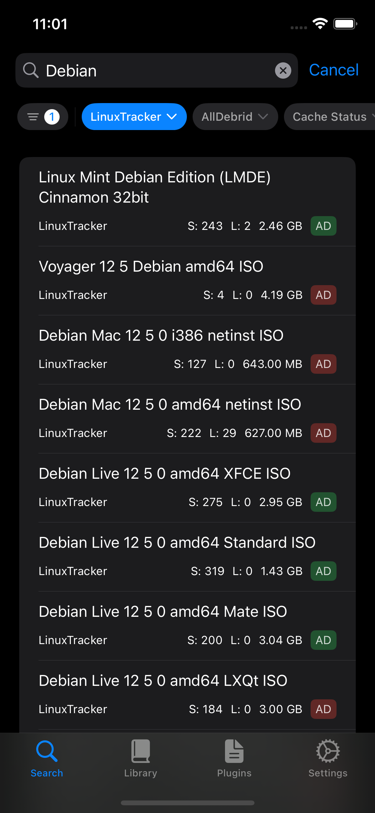
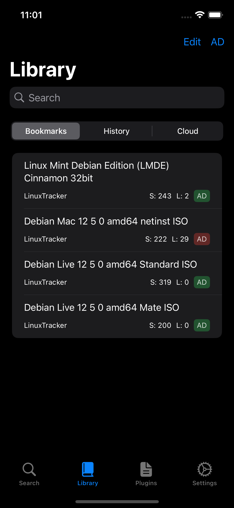
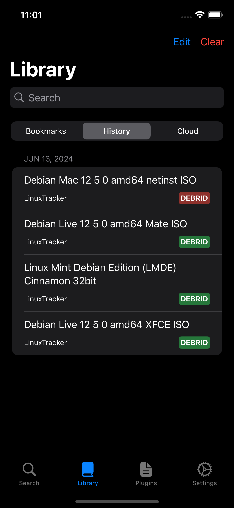
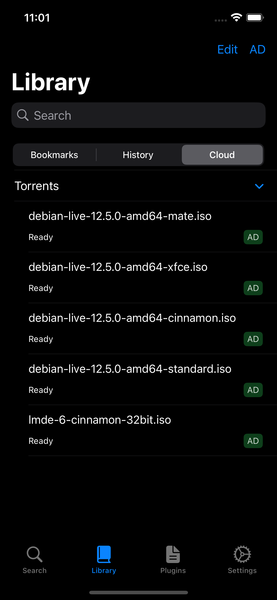
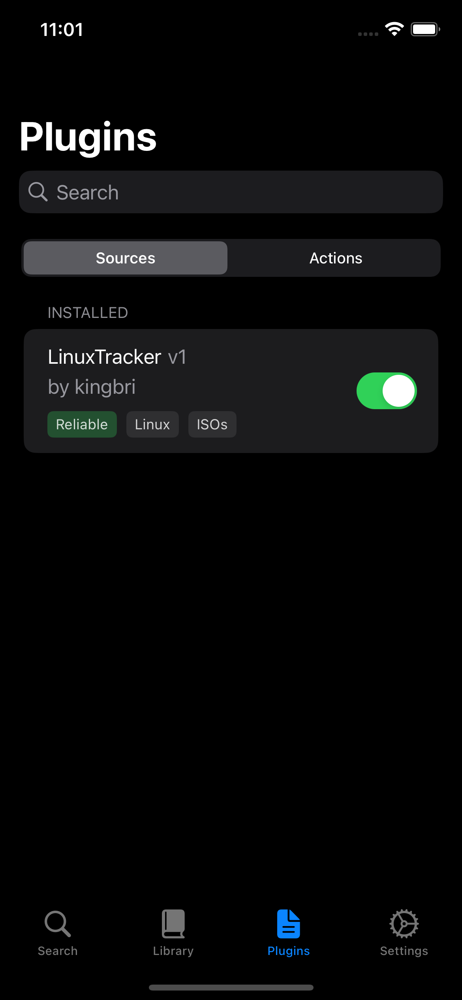
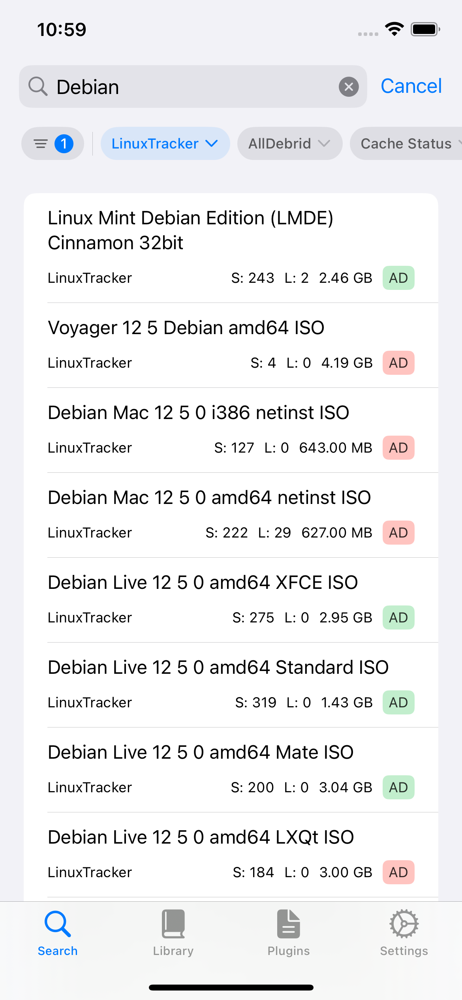
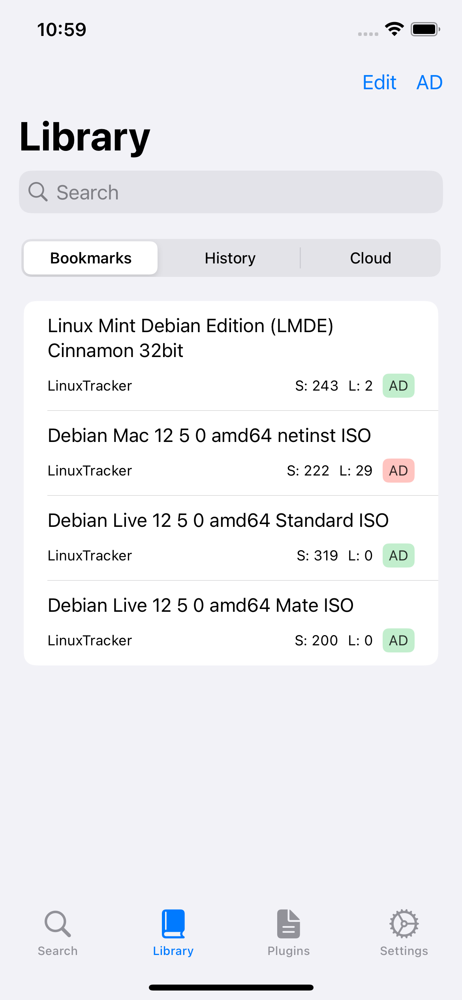
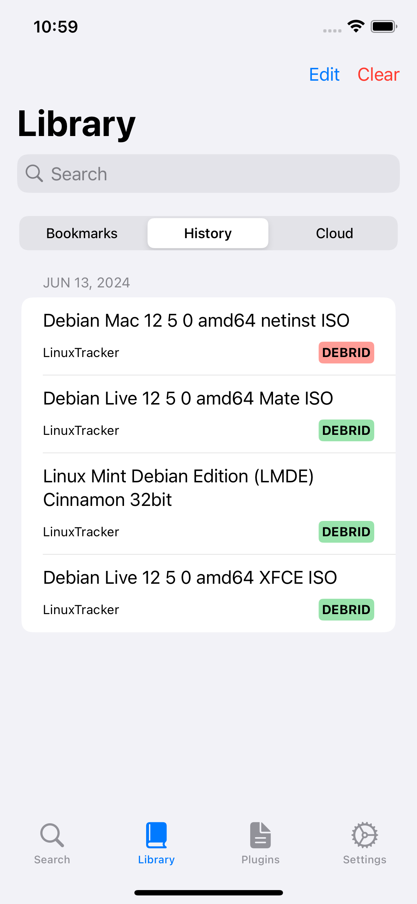
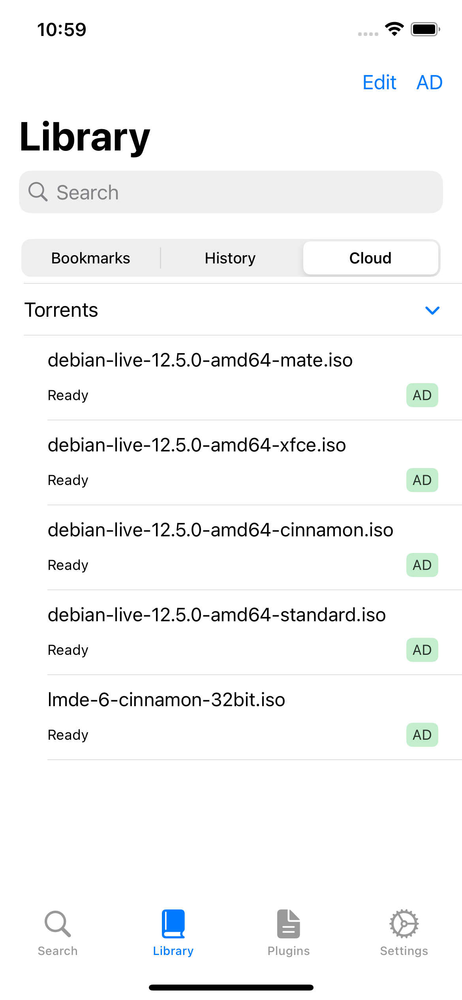
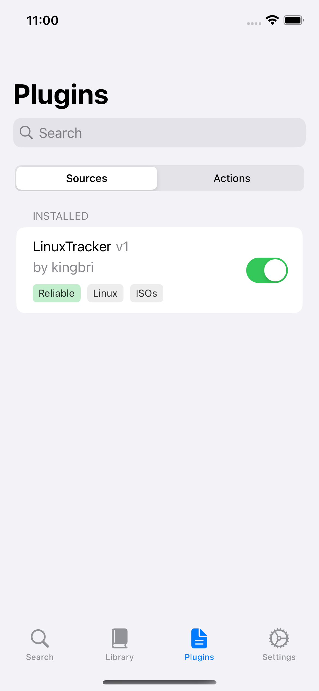

# Ferrite

    
    
    
    

    
    

A media search engine for iOS with a plugin API to extend its functionality.

## Disclaimer

This project is developed with a hobbyist/educational purpose and I am not responsible for what happens when you install Ferrite.

Ferrite does not and will never host any content. It is a search engine and will be nothing more.

## Why did I make this?

Finding shows and movies is usually pretty easy because there are many websites out there with the ability to search for the files you want.

However, the main problem is that these websites tend to suck in terms of UI or finding media to watch. Ferrite aims to provide a better UI to search and find the media you want.

I also wanted to support the use of debrid services since there aren't any (free) options on iOS that have support for this service.

## Features

- [x] Ad-free
- [x] Clean UI with native performance
- [x] Powerful search with an intuitive filter system
- [x] Modular plugin system
- [x] Integrates with many debrid providers
- [x] Flexible parser system written in native Swift
- [x] Local library with bookmarks and history
- [x] Manage your debrid cloud
- [x] Does not pollute your debrid cloud
- [x] Kodi integration

If there's a feature that's not listed here, open an issue or ask in the support Discord.

## What iOS versions are supported?

To decide what minimum version of iOS is supported, Ferrite follows an "n - 2" patten. For example, if iOS 18 is the latest version, the minimum supported iOS version is 16 (18-2 = 16).

To make this easier, the minimum required iOS version and Ferrite versions are listed below:

- v0.8 and up: iOS 16 and up

- v0.7 and up: iOS 15 and up

- v0.6.x and lower: iOS 14 and up

## Supported debrid services

Ferrite primarily uses Debrid services for instant streaming. A list of supported services are provided below:

- RealDebrid
- AllDebrid
- Premiumize
- TorBox
- OffCloud

Want another debrid service? Make a request in issues or the support Discord.

## Downloads

At this time, Ferrite will only exist as an ipa. There are no plans to release on TestFlight or the App Store. Ipa builds are automatically built and are provided in Github actions artifacts.

## Plugins/Sources

Plugins are not provided by the application. They must be found from external means or you can make them yourself using the [wiki](https://github.com/bdashore3/Ferrite/wiki). Various communities have created sources for Ferrite and they can be imported in the app with ease.

There are two types of plugins:
- Source: A plugin that looks something up in an indexer
- Action: A plugin that "does" something, such as opening a result in a separate application

To start off, a plugin list is located here (you can copy and paste this in the app) -> [https://raw.githubusercontent.com/Ferrite-iOS/example-sources/default/public-domain-plugins.yml](https://raw.githubusercontent.com/Ferrite-iOS/example-sources/default/public-domain-plugins.yml)

## Building from source

Use the latest stable version of Xcode.

There are currently two branches in the repository:

- default: A snapshot of the latest stable build. Tags can also be used for older versions.
- next: The development branch. Nightlies are automatically built here.

## Nightly builds

Nightlies are builds automatically compiled by GitHub actions. These are development builds which may or may not be stable!

It is required to log into GitHub or ask for a [nightly link](https://nightly.link/) to grab a build.

To install a nightly build:

1. Download the artifact from GitHub actions

2. Unzip the file containing the ipa

3. Install the ipa on your device

## Contribution

If you have issues with the app:

- Describe the issue in detail
- If you have a feature request, please indicate it as so. Planned features are in a different section of the README, so be sure to read those before submitting.
- Please join [the discord](https://discord.gg/sYQxnuD7Fj) for more info and support

## Developers and Permissions

I try to make comments/commits as detailed as possible, but if you don't understand something, please contact me via Discord.

Creator/Developer: kingbri

Developer Website: [kingbri.dev](https://kingbri.dev)

Developer Discord: kingbri#6666

Join the support discord here: [Ferrite Discord](https://discord.gg/sYQxnuD7Fj)

## Screenshots

### Dark Mode

| Search | Bookmarks | History |
| ------------- | -------- | -------- |
|  |  |  |

| Debrid Cloud | Plugins |
| ----------- | -------------------- |
|  |  |

### Light Mode

| Search | Bookmarks | History |
| ------------- | -------- | -------- |
|  |  |  |

| Debrid Cloud | Plugins |
| ----------- | -------------------- |
|  |  |
